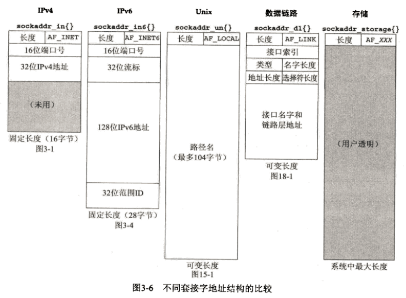
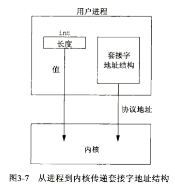
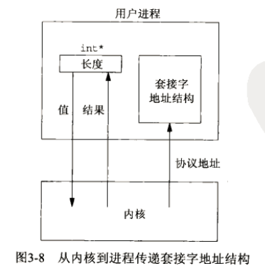
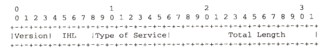

# UNP-Part2-Chapter3笔记（套接字编程简介）
- - -
[TOC]
## 1 概述
地址转换函数 ( 地址的文本表达 <==> 存放在地址结构中的二进制值 )
>只适用于 `IPv4`
>> - inet_addr
>> - inet_ntoa
>
>同时适用于 `IPv4` 和 `IPv6`
>> - inet_pton
>> - inet_ntop

## 2 套接字地址结构
大多数 `socket函数`都需要一个指向 `socket地址结构`的指针作为参数。每个协议族都定义自己的 `socket地址结构`。这些结构名字均以 `sockaddr_`开头，并以对应每个协议族的唯一后缀结尾。
### 2.1 IPv4套接字地址结构
IPv4套接字地址结构以 `sockaddr_in`命名，定义在头文件 `<netinet/in.h>`中
```cpp
// IPv4 Socket Address Structure
struct in_addr {
  in_addr_t         s_addr;        /* 32位 IPv4 地址, 网络字节序(大端) */
};
struct sockaddr_in {
  uint8_t           sin_len;       /* 结构体长度 */
  sa_family_t       sin_family;    /* AF_INET */
  in_port_t         sin_port;      /* 16-bit 端口号, 网络字节序(大端) */
  struct in_addr    sin_addr;      /* 32-bit IPv4 地址, 网络字节序(大端) */
  char              sin_zero[8];   /* unused */
};
```
对以上结构的几点一般性说明：
- POSIX规范不要求有`sin_len`成员，`sin_len`的典型数据类型为 `uint8_t`，若地址结构中存在`sin_len`成员， `sin_family`为`unsined short`，否则 `sin_family`为`uint8_t`。
- 除非涉及路由套接字（Chapter 8），否则即使有长度字段`sin_len`也无需设置和检查。
- POSIX规范只需要地址结构中的3个字段： `sin_family`、`sin_addr`、`sin_port`，因此所有套接字地址结构大小至少为 16字节。定义额外的字段对符合 POSIX的实现来说也很正常（几乎所有实现都有`sin_zero`字段）。
- 对于字段 `s_addr`、`sin_family`、`sin_port`的 POSIX数据类型。`in_addr_t类型`必须至少为 `uint32_t`，`in_port_t类型`必须至少是 `uint16_t`，而`sa_family`则一般视是否有长度字段决定，若存在`sin_len`字段则为`uint8_t`，否则为`uint16_t`。下表为部分 POSIX定义的数据类型。

| 数据类型   | 说明   | 头文件 |
|----------|--------|-------|
| int8_t   | 带符号8位整数  | < sys/types.h> |
| uint8_t  | 无符号8位整数  | < sys/types.h> |
| int16_t  | 带符号16位整数 | < sys/types.h> |
| uint16_t | 无符号16位整数 | < sys/types.h> |
| int32_t  | 带符号32位整数 | < sys/types.h> |
| uint32_t | 无符号32位整数 | < sys/types.h> |
| sa_family_t | 套接字地址结构的地址族                | < sys/socket.h> |
| socklen_t   | 套接字地址结构的长度，一般为 uint32_t  | < sys/socket.h> |
| in_addr_t   | IPv4 地址，一般为 uint32_t          | < netinet/in.h> |
| in_port_t   | TCP 或 UDP 端口，一般为 uint16_t    | < netinet/in.h> |

- 部分已过时数据类型仅为向后兼容才提供，包括`u_char`、`u_short`、`u_int`和`u_long`。
- IPv4 的地址以及 TCP和 UDP端口号均以`网络字节序`存储，关于`主机字节序`和`网络字节序`见 3.4节。
- 32位 IPv4地址的两种访问方法。`按 in_addr结构引用`和`按 in_addr_t(uint32_t)引用`。编译器对传递结构和传递整数的处理是完全不同的。
- `sin_zero`字段直接把整个结构置0即可。
 > 通常`sin_zero`不置0也没问题，但是当捆绑一个非通配的 IPv4地址时，该字段必须为0（TCPv2 Page 731~732）。
- 套接字地址结构仅在给定主机上使用：虽然结构中的某些字段（例如 IP地址和端口号）用在不同主机之间的通信中，但结构本身并不在主机之间传递。

### 2.2 通用套接字地址结构
>当作为一个参数传递到任何套接字函数时，套接字地址结构总是以引用形式（指向结构的指针）来传递。然而以这样的指针作为参数之一的任何套接字函数必须处理来自所支持的任何协议族的套接字地址结构。
>
>>在如何声明所传递指针的数据类型上存在一个问题。有了ANSI C后使用 `void *`可以解决。而套接字是在ANSI C之前定义的，在1982年采取的方法是在 < sys/socket.h>头文件中定义一个通用的套接字地址结构，如下。

```cpp
struct sockaddr {
  uint8_t      sa_len;
  sa_family_t  sa_family;       /* address family: AF_xxx value */
  char         sa_data[4];      /* protocol-specific address */
};
```
于是套接字函数被定义为以指向某个通用套接字地址结构的一个指针作为其参数之一，例如 bind函数的 ANSI C函数原型：
```cpp
int bind(int, struct sockaddr *, socklen_t);
```
所以在调用这些函数时必须要将套接字地址结构指针强制转换，变成指向通用套接字地址结构的指针，例如：
```cpp
struct sockaddr_in serv;       /* IPv4 socket address structure */

/* fill in serv() */

bind(sockfd, (struct sockaddr *)&serv, sizeof(serv));
```
如果省略了强制类型转换，那么编译器将会产生警告。从应用程序开发人员的观点看，通用套接字结构的唯一用途就是对特定于协议的套接字地址结构的指针执行类型强制转换。
> 从内核的角度看，使用指向通用套接字的指针另有原因：内核必须取调用者的指针，并强制转换为`struct sockaddr *`类型，然后通过检查`sa_family`字段确定结构的真实类型。

### 2.3 IPv6 套接字地址结构
IPv6 套接字地址结构在 `<netinet/in.h>`头文件中定义，如下：
```cpp
struct in6_addr {
  uint8_t   s6_addr[16];         /* 128位 IPv6地址，网络字节序(大端) */
};
#define SIN6_LEN            /* 用于编译时测试 */
struct sockaddr_in6 {
  uint8_t          sin6_len;       /* 结构体长度 */
  sa_family_t      sin6_family;    /* AF_INET6 */
  in_port_t        sin6_port;      /* 传输层端口号，网络字节序(大端) */
  uint32_t         sin6_flowinfo;  /* flow信息，未定义 */
  struct in6_addr  sin6_addr;      /* IPv6 地址，网络字节序(大端) */
  uint32_t         sin6_scope_id;  /* set of interfaces for a scope */
};
```
对上面结构，有以下几点要注意：
- 如果系统支持套接字地址结构中的长度字段，那么`SIN6_LEN`常值必须定义。
- `IPv6` 的地址族是 `AF_INET6`，而 `IPv4` 的地址族是 `AF_INET`。
- 结构中字段的先后顺序做过编排，使得如果`sockaddr_in6`结构本身是64位对齐的，那么128位的`sin6_addr`字段也是64位对齐的。在一些64位处理机上，如果64位数据存储在某个64位边界位置，那么对它的访问将得到优化处理。
- `sin6_flowinfo`字段分成两个字段：
	- 低序20位是流标（flow label）;(流标字段使用随图A-2讲解)
	- 高序12位保留。
- 对于具备范围的地址(scoped address)，`sin_scope_id`字段标识其范围(scope)，最常见的是链路局部地址(link-local address)的接口索引(interface index)(见A.5节)。

### 2.4 新的通用套接字地址接口
作为 IPv6套接字API的一部分而定义的新的通用套接字地址结构克服了现有`struct sockaddr`的一些缺点。不像`struct sockaddr`，新的`struct sockaddr_storage`足以容纳系统所支持的任何套接字地址结构。`sockaddr_storage`结构在`<netinet.h>`头文件中定义，如下图：
```cpp
struct sockaddr_storage {
  uint8_t        ss_len;         /* 该结构体长度（独立实现） */
  sa_family_t    ss_family;      /* address family: AF_xxx value */
  /* other content (transparent to user) */
}
```
`sockaddr_storage`类型提供的通用套接字地址结构相比`sockaddr`存在以下两点差别：
1. 如果系统支持的任何套接字地址结构有对齐需要，那么`sockaddr_storage`能够满足最苛刻的对齐要求。
2. `sockaddr_storage`足够大，能够容纳系统支持的任何套接字地址结构。
注意，除了`ss_family`和`ss_len`外（如果有的话），`sockaddr_storage`结构中其他字段对用户来说是透明的。`sockaddr_storage`结构必须类型强制转换成或复制到适合于`ss_family`字段所给出的地址类型的套接字地址结构中，才能访问其他字段。

### 2.5 套接字地址结构的比较
在图3-6中，我们对5种套接字地址结构进行了比较：`IPv4`、`IPv6`、`Unix域`、`数据链路`和`存储`。我们假设所有套接字地址结构都包含一个单字节的长度字段，地址族字段也占用一个字节，其他字段都占用确切的最短长度。
> `IPv4`和`IPv6`套接字地址结构是固定长度的，而`Unix域`和`数据链路`结构是可变长度的。为了处理长度可变的结构，当我们把指向某个套接字地址结构的指针作为一个参数传递给某个套接字函数时，也把该结构的长度作为另一个参数传递给这个函数。我们在每种长度固定的结构下方给出了这种结构的字节数长度（就4.4BSD实现而言）。



## 3 值-结果参数
当往一个套接字函数传递一个套接字地址结构时，该结构总是以引用形式传递，即传递的是指向该结构的一个指针。该结构的长度也作为一个参数来传递，不过传递方式取决于传递方向：
> `从进程到内核` 和 `从内核到进程`

- 从进程到内核：
从进程到内核传递套接字地址结构的函数有3个：`bind`、`connect`和`sendto`。这些函数的一个参数值指向某个套接字地址结构的指针，另一个参数是该结构的整数大小，例如：
```cpp
struct sockaddr_in  serv;
/* fill in serv{} */
connect(sockfd, (SA *)&serv, sizeof(serv));
```
既然指针和指针所指内容的大小都传递给了内核，于是内核知道到底需从进程复制多少数据进来，下图（图3-7）展示了这个情形。


套接字地址结构大小的数据类型实际是`socklen_t`，而不是 int，不过 POSIX规范建议将`socklen_t`定义为`uint32_t`。

- 从内核到进程：
从内核到进程传递套接字地址结构的函数有4个：`accept`、`recvfrom`、`getsockname`和`getpeername`。这4个函数的其中两个参数是指向某个套接字地址结构的指针和指向表示该结构大小的整数变量的指针。例如：
```cpp
struct sockaddr_un  cli;     /* Unix domain */
socklen_t len;
len = sizeof(cli);           /* len is a value */
getpeername(unixfd, (SA *)&cli, &len);
/* len may have changed */
```
把套接字地址结构大小这个参数从一个整数改为指向某个整数变量的指针，其原因在于：当函数被调用时，结构大小是一个值（value），它告诉内核该结构的大小，这样内核在写该结构时不至于越界；当函数返回时，结构大小又是一个结果（result），它告诉进程内核在该结构中究竟存储了多少信息。这种类型的参数称为`值-结果（value-result）参数`。图3-8展示了这个情形。


传递套接字地址结构的函数还有两个：`recvmsg`和`sendmsg`。它们的套接字地址结构长度不是作为函数参数而是作为结构字段传递的。

> 当使用`value-result参数`作为套接字地址结构的长度时，如果套接字地址结构是固定长度的，那么从内核返回的值总是那个固定长度，例如`IPv4`（sockaddr_in长度是16）和`IPv6`（sockaddr_in6长度是28）。然而对于可变长度的套接字地址结构（例如 Unix域的 `sockaddr_un`），返回值可能小于该结构的最大长度。
>> 在网络编程中，`value-result参数`最常见的例子是所返回套接字地址结构的长度。不过除此以外还有其他的`value-result参数`:
>> - `select`函数中间的3个参数（见6.3节）；
>> - `getsockopt`函数的长度参数（见7.2节）；
>> - 使用`recvmsg`函数时，msghdr结构中的 msg_namelen 和 msg_controllen字段（见14.5节）；
>> - `ifconf`结构中的 ifc_len字段（见图17-2）；
>> - `sysctl`函数两个长度参数中的第一个（见18.4节）。

## 4 字节排序函数
> - `小端字节序（little-endian）`：低字节 -> 低地址
> - `大端字节序（big-endian）`：高字节 -> 低地址

系统所用的字节序称为`主机字节序（host byte order）`，网络协议则必须指定一个`网络字节序（network byte order）`,网际协议使用**大端字节序**来传送多字节整数。主机字节序和网络字节序的互相转换使用以下4个函数：
```cpp
#include <netinet/in.h>
/*
  h -> host
  n -> network
  s -> short
  l -> long（即使是64位系统中，这里也表示32位值）
*/
uint16_t htons(uint16_t host16bitvalue);
uint32_t htonl(uint32_t host32bitvalue);
uint16_t ntohs(uint16_t net16bitvalue);
uint32_t ntohl(uint32_t net32bitvalue);
```
位序问题：最左边的位是最早出现的最高有效位，即分配给最高有效位的编号为0，如下：


## 5 字节操纵函数
有两组操纵多字节字段的函数。名字以 b（表示字节）开头的第一组函数起源于4.2BSD，几乎所有现今支持套接字函数的系统仍然提供它们。名字以 mem（表示内存）开头的第二组函数起源于 ANSI C标准，支持 ANSI C函数库的所有系统都提供它们。
- 源自 Berkeley的函数
```cpp
#include <strings.h>
void bzero(void *dest, size_t nbytes);
void bcopy(const void *src, void *dest, size_t nbytes);
int bcmp(const void *ptr1, const void *ptr2, size_t nbytes); /* 若相等返回 0 */
```
- ANSI C函数
```cpp
#include <string.h>
void *memset(void *dest, int c, size_t len);
void *memcpy(void *dest, const void *src, size_t nbytes);
int memcmp(const void *ptr1, const void *ptr2, size_t nbytes);
```


